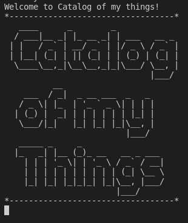
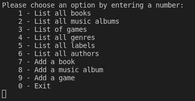

#  Catalog of my things

> In this project we have practiced Object Oriented Programming by adding classes and using OOP principles, Describe the SOLID principles of OOP, Insert and query data in SQL, Create a UML class diagram, Store data in files, Build interactive console apps, and Recognize the value of making equal contributions to group projects to produce the best outcome.

| Starting | Options|
|-----------------|---------------|
|  |  |

## Built With

- Ruby
- OOP
- SQL Postgres

## Getting Started
To get a local copy up and running follow these simple example steps.

- Click on the top right green "code" button.
- On the dropdown menu, choose "download with zip" button.
- After download, extract the zip file and you have the project on your machine.
- Run `bundle init` to create the Gemfile.
- Run `gem i rspec` to add rspec.
- Run `gem i rubocop` to add rubocop.
- Run `gem i os` to add os.
- Run `ruby main.rb` to run the application.

## Video Demo

[Link](https://drive.google.com/file/d/1EeipPYYXPgkOnhBcyxl0coZlvj43730h/view?usp=sharing)

## Testing

Run `rspec` to check the testing.

## Authors

👤 **Kerolous Samy**

- GitHub: [@kerolous](https://github.com/keroloussamy)
- Twitter: [@kerolous](https://twitter.com/SamyKerolous)
- LinkedIn: [kerolous](https://www.linkedin.com/in/keroloussamy/)

👤 **Luis Abarca**

- GitHub: [@TheLuisAbarca](https://github.com/TheLuisAbarca)
- Twitter: [@TheLuisAbarca](https://twitter.com/TheLuisAbarca)
- LinkedIn: [Luís Anghelo Abarca Villacís](https://www.linkedin.com/in/techadvisor-luis-abarca/)

👤 **Mihreteab Misganaw Aride**

- GitHub: [@Mre55](https://github.com/Mre55)
- Twitter: [@MreMisganaw](https://twitter.com/MreMisganaw)
- LinkedIn: [Mihreteab Aride](https://www.linkedin.com/in/mihreteab-aride-86249812b/)

## 🤝 Contributing

Contributions, issues, and feature requests are welcome!

Feel free to check the [issues page](../../issues/).

## Show your support

Give a ⭐️ if you like this project!

## Acknowledgments

- Hat tip to anyone whose code was used
- Inspiration
- etc

## 📝 License

This project is [MIT](./MIT.md) licensed.
